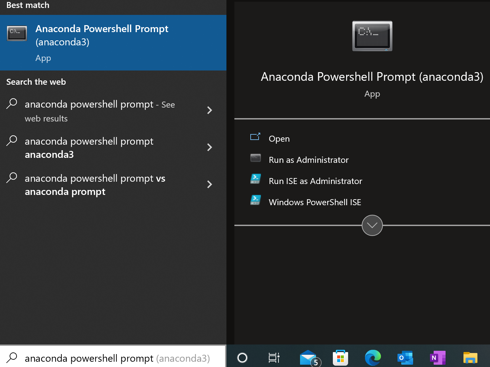

# toffy
The toffy repo is designed to simplify the process of generating and processing data on the MIBIScope platform.

This repo is currently in beta testing. None of the code has been published yet, and we will be making breaking changes frequently. If you find bugs, please [open an issue](https://github.com/angelolab/toffy/issues/new/choose). If you have questions or want to collaborate, please reach out to Noah (nfgreen@stanford.edu)

## Table of Contents
- [Overview](#overview)
  - [1. Using toffy for the first time](#1-using-toffy-for-the-first-time)
  - [2. Setting up a MIBI run](#2-setting-up-a-mibi-run)
  - [3. Evaluating a MIBI run](#3-evaluating-a-mibi-run)
  - [4. Processing data after a MIBI run](#4-processing-mibi-data)
  - [5. Formatting data for downstream analysis](#5-formatting-mibi-runs-for-analysis)
- [Installation](#installation)
  - [Requirements for specific operating systems](#requirements-for-specific-operating-systems)
    - [Windows](#windows)
    - [macOS](#macos)
  - [Setting up the virtual environment](#setting-up-the-virtual-environment)
  - [Using the repo](#using-the-repo)
  - [Updating the repo](#updating-the-repo)
- [Questions?](#questions)

## Overview
The repo has four main parts, with associated code and jupyter notebooks for each

### 1. Using toffy for the first time
The first time you use toffy on one of the commercial instruments, you'll need to perform some basic tasks to ensure everything is working properly. The [set up](./templates/1_set_up_toffy.ipynb) jupyter notebook will guide you through this process

### 2. Setting up a MIBI run 
For large MIBI runs, it is often convenient to automatically generate the JSON file containing the individual FOVs. There are two notebooks for this task, one for large tiled regions, the second for TMAs. If you will be tiling multiple adjacent FOVs together into a single image, the [tiling](./templates/2_create_tiled_mibi_run.ipynb) notebook can automate this process. You provide the location of the top corner of the tiled region, along with the number of fovs along the rows and columns, and it will automatically create the appropriate JSON file. 

The [second notebook](./templates/2_create_tma_mibi_run.ipynb) is for TMAs. This notebook is run after you have selected the appropriate cores from the TMA. It will generate an overlay with the image of the TMA and the locations you picked to ensure you selected the correct cores. It will then check that they are named correctly and that there are no duplicates.

### 3. Evaluating a MIBI run
There are a number of different computational tasks to complete once a MIBI run has finished to ensure everything went smoothly. 

- 3a: real time monitoring. The [MIBI monitoring](./templates/3a_monitor_MIBI_run.ipynb) notebook will monitor an ongoing MIBI run, and begin processing the image data as soon as it is generated. This notebook is being continually be updated as we move more of our processing pipeline to happen in real time as the data is generated.
- 3b: post-run monitoring. For each step in the monitoring notebook, we have a dedicated notebook that can perform the same tasks once a run is complete. This includes [the image extraction notebook](./templates/extract_bin_file.ipynb) and the [qc metrics notebook](./templates/3b_generate_qc_metrics.ipynb). 

### 4. Processing MIBI data
Once your run has finished, you can begin to process the data to make it ready for analysis. To remove background signal contamination, as well as compensate for channel crosstalk, you can use the [compensation](./templates/4a_compensate_image_data.ipynb) notebook. This will guide you through the Rosetta algorithm, which uses a flow-cytometry style compensation approach to remove spurious signal. 

Following compensation, you will want to normalize your images to ensure consistent intensity across the run. You can use the [normalization](./templates/4b_normalize_image_data.ipynb) notebook to perform this step. 


### 5. Formatting MIBI runs for analysis
After the image processing and cleanup from *toffy* is complete, the final step is to format your data to faciliate easy downstream analysis. The [reorganization](./templates/5_rename_and_reorganize.ipynb) notebook will walk you through the process of renaming FOVs, combining partial runs, and consolidating your images.

## Installation
In order to get toffy working, you'll need to first install the repo. 

### Requirements for specific operating systems
The process of setting up is largely the same for different operating systems. However, there are a few key differences. 

#### Windows

- You must have **C++ Build Tools** (VS19) installed. 
Go to  https://visualstudio.microsoft.com/visual-cpp-build-tools/ and click 'Download Build Tools'.
Open the installer and make sure you are installing the package labeled *C++ build tools*, then follow the prompts.
    - **(If installing on CAC, you will need the admin password and must contact support@ionpath.com)**

- You will need the latest version of Anaconda (**Miniconda** preferred). 
Download here: https://docs.conda.io/en/latest/miniconda.html and select the appropriate download for your system.
Choose "Just Me" option for installation, and do not need to select the "Tutorial" or "Getting Started" options.
Continue with the installation.

#### macOS
- You will need the latest version of Anaconda (**Miniconda** preferred). 
Download here: https://docs.conda.io/en/latest/miniconda.html and select the appropriate download for your system.
Choose "Just Me" option for installation, and do not need to select the "Tutorial" or "Getting Started" options.
Continue with the installation.

### Setting up the virtual environment
* For Windows, you will need open the Anaconda powershell prompt instead of the regular powershell prompt for the following.
<p align="center">

</p>

* If macOS user, open terminal. 

If you do not already have git installed, run
```
conda install git
```
Navigate to the desired location (ex: Documents) and clone the repo.
```
cd .\Documents\
git clone https://github.com/angelolab/toffy.git
```

Move into directory and build the environment

```
cd toffy
conda env create -f environment.yml
```

This creates a *Python 3.8* environment named `toffy_env`. You can view everything that gets installed by looking at the `environment.yml` file.

### Using the repo
Once you're ready to use the repo, enter the following commands. 

First, activate the environment:

```
conda activate toffy_env
```

Once activated, notebooks can be used via this command:

```
jupyter lab --allow-root
```

You can leave the jupyter notebook running once you're done. If it ever gets closed or you need to reopen it, just follow the steps above.

### Updating the repo

The toffy repo is constantly being updated. In order to get those changes to your version, you'll need to tell git to update with the following command:
```
git pull
```

After performing the above command, you will sometimes need to update your environment:

```
conda remove --name toffy_env --all
conda env create -f environment.yml
```


## Questions?

Feel free to open an [issue](https://github.com/angelolab/toffy/issues) on our GitHub page.

Before opening, please double check and see that someone else hasn't opened an issue for your question already.
