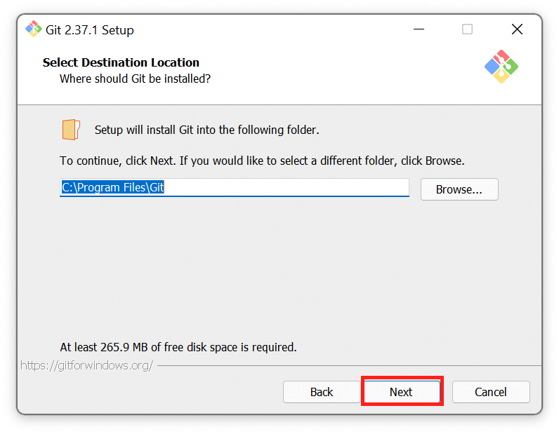
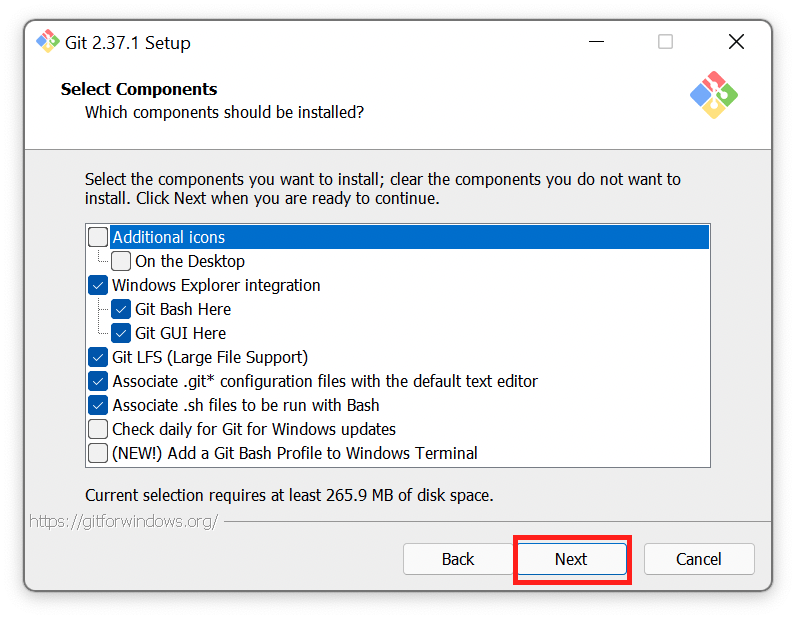
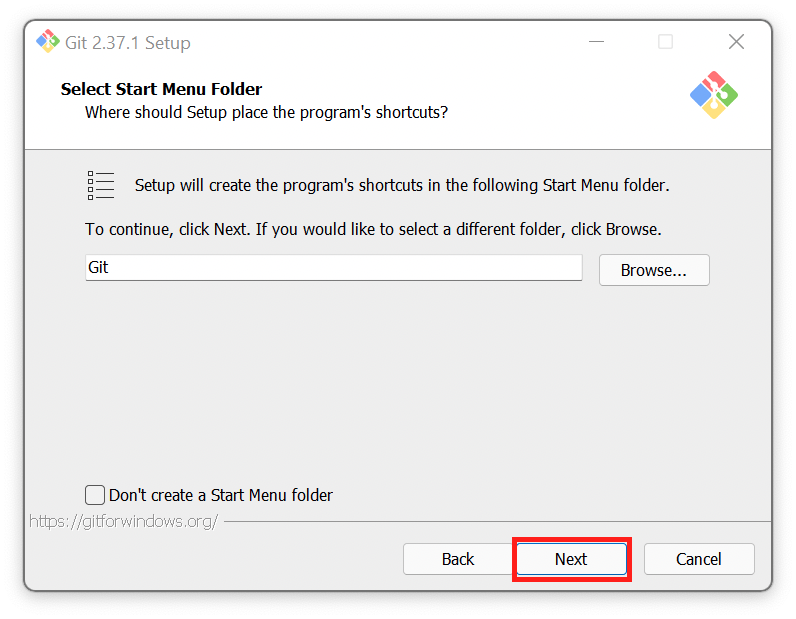
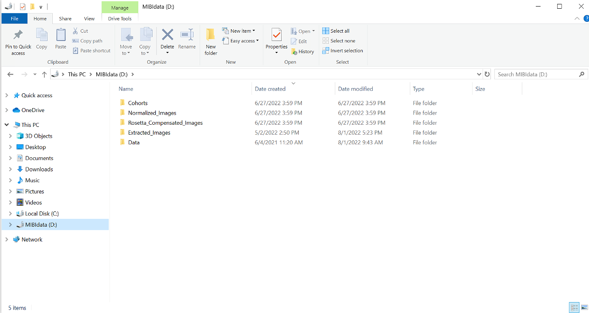
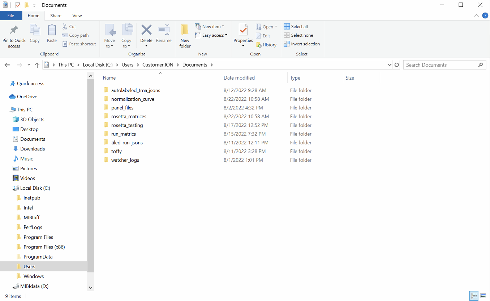
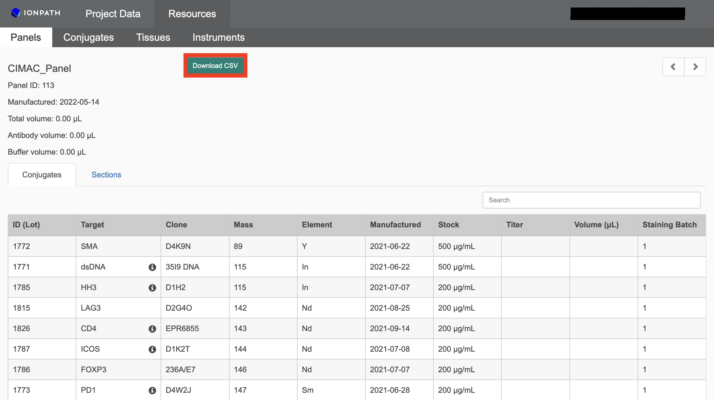

# toffy
The toffy repo is designed to simplify the process of generating and processing data on the MIBIScope platform.

This repo is currently in beta testing. None of the code has been published yet, and we will be making breaking changes frequently. If you find bugs, please [open an issue](https://github.com/angelolab/toffy/issues/new/choose). If you have questions or want to collaborate, please reach out to Noah (nfgreen@stanford.edu)

## Table of Contents
- [Overview](#overview)
  - [1. Using toffy for the first time](#1-using-toffy-for-the-first-time)
  - [2. Setting up a MIBI run](#2-setting-up-a-mibi-run)
  - [3. Evaluating a MIBI run](#3-evaluating-a-mibi-run)
  - [4. Processing data after a MIBI run](#4-processing-mibi-data)
  - [5. Formatting data for downstream analysis](#5-formatting-mibi-runs-for-analysis)
- [Installation](#installation)
  - [Requirements for specific operating systems](#requirements-for-specific-operating-systems)
    - [Windows](#windows)
    - [macOS](#macos)
  - [Setting up the virtual environment](#setting-up-the-virtual-environment)
  - [Using the repo](#using-the-repo)
  - [Updating the repo](#updating-the-repo)
- [Directory structure](#directory-structure)
- [Panel format](#panel-format)
- [Median Pulse Height](#median-pulse-height)
- [Questions?](#questions)

## Overview
The repo has four main parts, with associated code and jupyter notebooks for each. 
We have also recorded workshop talks which complement the repository. [MIBI Workshop (Pre-Recorded Lectures) Playlist](https://www.youtube.com/playlist?list=PLjNbkEm4vA27f8-EB7q9u_lDPI7oxohhn).

### 1. Using toffy for the first time
The first time you use toffy on one of the commercial instruments, you'll need to perform some basic tasks to ensure everything is working properly. The [set up](./templates/1_set_up_toffy.ipynb) jupyter notebook will guide you through this process and the resulting directory structure is explained below ([directory structure](#directory-structure)).
[Workshop Talk: Toffy Setup](https://youtu.be/g52-oqP_QjA?list=PLjNbkEm4vA27f8-EB7q9u_lDPI7oxohhn&t=243)

### 2. Setting up a MIBI run 
For large MIBI runs, it is often convenient to automatically generate the JSON file containing the individual FOVs. There are two notebooks for this task, one for large tiled regions, the second for TMAs. If you will be tiling multiple adjacent FOVs together into a single image, the [tiling](./templates/2_create_tiled_mibi_run.ipynb) notebook can automate this process. You provide the location of the top corner of the tiled region, along with the number of fovs along the rows and columns, and it will automatically create the appropriate JSON file. 

The [second notebook](./templates/2_create_tma_mibi_run.ipynb) is for TMAs. This notebook is run after you have selected the appropriate cores from the TMA. It will generate an overlay with the image of the TMA and the locations you picked to ensure you selected the correct cores. It will then check that they are named correctly and that there are no duplicates.

[Workshop Talk: MIBI Tiling Tutorial](https://www.youtube.com/watch?v=U0C_nMT9CBQ&list=PLjNbkEm4vA27f8-EB7q9u_lDPI7oxohhn&index=2)


### 3. Evaluating a MIBI run
There are a number of different computational tasks to complete once a MIBI run has finished to ensure everything went smoothly. 

- 3a: real time monitoring. The [MIBI monitoring](./templates/3a_monitor_MIBI_run.ipynb) notebook will monitor an ongoing MIBI run, and begin processing the image data as soon as it is generated. This notebook is being continually be updated as we move more of our processing pipeline to happen in real time as the data is generated.
[Workshop Talk: Real-Time Monitoring](https://www.youtube.com/watch?v=o1nHJ5dGcTQ&list=PLjNbkEm4vA27f8-EB7q9u_lDPI7oxohhn&index=4)
- 3b - 3e: post-run monitoring. For each step in the monitoring notebook, we have a dedicated notebook that can perform the same tasks once a run is complete. 
[Workshop Talk: Image Processing and Extraction](https://www.youtube.com/watch?v=QSzjW-cuZtg&list=PLjNbkEm4vA27f8-EB7q9u_lDPI7oxohhn&index=3)
  - 3b: [image extraction notebook](./templates/3b_extract_images_from_bin.ipynb) will extract images from bin files that have not already been processed
  - 3c: [qc metrics notebook](./templates/3c_generate_qc_metrics.ipynb) computes and visualizes the QC metrics for the images
  - 3d: [median pulse heights notebook](./templates/3d_compute_median_pulse_height.ipynb) generates plots showing median pulse heights for each FOV, along with estimated run time
  - 3e: [stitch images notebook](./templates/3e_stitch_images.ipynb) creates a single stitched image for each channel in your panel across all of the FOVs in your run

### 4. Processing MIBI data
Once your run has finished, you can begin to process the data to make it ready for analysis. To remove background signal contamination, as well as compensate for channel crosstalk, you can use the [compensation](./templates/4a_compensate_image_data.ipynb) notebook. This will guide you through the Rosetta algorithm, which uses a flow-cytometry style compensation approach to remove spurious signal. 

Following compensation, you will want to normalize your images to ensure consistent intensity across the run. You can use the [normalization](./templates/4b_normalize_image_data.ipynb) notebook to perform this step.

### 5. Formatting MIBI runs for analysis
After the image processing and cleanup from *toffy* is complete, the final step is to format your data to faciliate easy downstream analysis. The [reorganization](./templates/5_rename_and_reorganize.ipynb) notebook will walk you through the process of renaming FOVs, combining partial runs, and consolidating your images.
[Workshop Talk: Reorganizing your Data](https://www.youtube.com/watch?v=nKYGWQ7GXC4&list=PLjNbkEm4vA27f8-EB7q9u_lDPI7oxohhn&index=5)

## Pipeline Flowchart


## Installation
In order to get toffy working, you'll need to first install some dependencies and the repository itself. [Workshop Talk: Toffy Setup](https://www.youtube.com/watch?v=g52-oqP_QjA&list=PLjNbkEm4vA27f8-EB7q9u_lDPI7oxohhn&index=1)

### Requirements for specific operating systems
The process of setting up is largely the same for different operating systems. However, there are a few key differences. 

#### Windows

- You must have **C++ Build Tools** (VS19) installed. 
Go to  https://visualstudio.microsoft.com/visual-cpp-build-tools/ and click 'Download Build Tools'.
Open the installer and make sure you are installing the package labeled *C++ build tools*, then follow the prompts.
    - **(If installing on CAC, you will need the admin password and must contact support@ionpath.com)**
    - **Git - CAC:** We highly recommend installing git system-wide on the CAC, by downloading the installation utility [here](https://git-scm.com/downloads).
       1. Under Standalone Installer, click the 64-bit Git for Windows Setup link to download the proper installer.
       2. Run the Git setup `.exe` file. It should be version 2.37.1 or higher.
       3. Click `Yes` to allow Git to make the necessary changes.
       4. Click `Next` to accept the GNU License. 
       5. Click `Next` to save Git in it's default location. 
       6. Next, the installer will give you a list of options for each menu. Leave everything to it's default. **We recommend to not change anything, unless you are confident on what you are doing.**
       7. The last menu, will ask if you would like to use any experimental options. Click `Install`, and leave the experimental options unchecked. This will now install Git. .
       8.  Open the Windows Terminal, and within the Powershell Tab type `Git` and hit enter. If you see the following output, you're good to go! 

- You will need the latest version of Anaconda (**Miniconda** preferred). 
Download here: https://docs.conda.io/en/latest/miniconda.html and select the appropriate download for your system.
Choose "Just Me" option for installation, and do not need to select the "Tutorial" or "Getting Started" options.
Continue with the installation.

#### macOS
- You will need the latest version of Anaconda (**Miniconda** preferred). 
Download here: https://docs.conda.io/en/latest/miniconda.html and select the appropriate download for your system.
Choose "Just Me" option for installation, and do not need to select the "Tutorial" or "Getting Started" options.
Continue with the installation.

### Setting up the virtual environment
* For Windows, you will need open the Anaconda powershell prompt instead of the regular powershell prompt for the following.
<p align="center">

</p>

* If macOS user, open terminal. 

If you do not already have git installed, run
```
conda install git
```
Navigate to the desired location (ex: Documents) and clone the repo.
```
cd .\Documents\
git clone https://github.com/angelolab/toffy.git
```

Move into directory and build the environment

```
cd toffy
conda env create -f environment.yml
```

This creates a *Python 3.8* environment named `toffy_env`. You can view everything that gets installed by looking at the `environment.yml` file.

### Using the repo
Once you're ready to use the repo, enter the following commands. 

First, activate the environment:

```
conda activate toffy_env
```

Once activated, notebooks can be used via this command for Windows:

```start_jupyter.sh```

or this command for macOS:

```./start_jupyter.sh```

You can leave the jupyter notebook running once you're done. If it ever gets closed or you need to reopen it, just follow the steps above.

### Updating the repo

The toffy repo is constantly being updated. In order to get those changes to your version, you'll need to tell git to update with the following command:

```
git pull
```

After performing the above command, you will sometimes need to update your environment:

```
conda remove --name toffy_env --all
conda env create -f environment.yml
```

To update the notebooks, run this command for Windows:

```
start_jupyter.sh -u
```

or this command for macOS:

```
./start_jupyter.sh -u
```

## Directory structure
Data from each run on the MIBI will be stored in the default base directory `D:\\Data`, in a subdirectory labeled with the run name.
The [set up](./templates/1_set_up_toffy.ipynb) jupyter notebook creates the following folders that will be used throughout toffy.
<br> <br>
Four new folders are created on the D drive:
- `Extracted_Images`: stores the raw images extracted from the bin files in either the [MIBI monitoring notebook](./templates/3a_monitor_MIBI_run.ipynb) or the [extraction notebook](./templates/3b_extract_images_from_bin.ipynb).
- `Rosetta_Compensated_Images`: contains the images after being processed with the Rosetta algorithm in the [compensate image data notebook](./templates/4a_compensate_image_data.ipynb)
- `Normalized_Images`: contains the images after accounting for intensity normalization in the [normalization notebook](./templates/4b_normalize_image_data.ipynb)
- `Cohorts`: final location of your completely processed image data after renaming the folders and files in the [renaming and reorganizing notebook](./templates/5_rename_and_reorganize.ipynb)

<figcaption align = "center"><b>Directories in D drive</b></figcaption>



Within `C:\\Users\\Customer.ION\\Documents` are directories that store necessary files used to set up and monitor a MIBI run.
- `normalization_curve`: directory which stores the normalization curve file for the machine that was produced by the [set up notebook](./templates/1_set_up_toffy.ipynb) and necessary for [notebook 4b](./templates/4b_normalize_image_data.ipynb)
- `tiled_image_jsons`: stores all files used to set up a tiled run in the [tiling notebook](./templates/2_create_tiled_mibi_run.ipynb)
- `autolabeled_tma_jsons`: stores all files used to set up a tma run in the [tma notebook](./templates/2_create_tma_mibi_run.ipynb)
- `panel_files`: directory containing the run panel file, needed for notebooks 3a, 3b, 4a, and 4b.
- `watcher_logs`: contains the log file of FOVs which have been processed in the [monitoring notebook](./templates/3a_monitor_MIBI_run.ipynb)
- `run_metrics`: contains the data files produced by the [QC](./templates/3c_generate_qc_metrics.ipynb) and [MPH notebooks](./templates/3d_compute_median_pulse_height.ipynb)
- `rosetta_matrices`: directory containing the finalized compensation matrix generated in the [compensation notebook](./templates/4a_compensate_image_data.ipynb)
- `rosetta_testing`: directory which stores the necessary files for and output of rosetta testing completed in the [compensation notebook](./templates/4a_compensate_image_data.ipynb)

<figcaption align = "center"><b>Directories in C drive</b></figcaption>



<br><br>
You can see below how to pin a folder to Quick Access, which can then be easily located in the section of the same name on the left side of File Explorer. 

We suggest pinning the following folders: `tiled_image_jsons`, `autolabeled_jsons`, `run_metrics`.


## Panel format
Many of the scripts in toffy require a panel file, identifying which targets have been put on which masses. You can download your panel online from the Ionpath MibiTracker under the resources tab. In the panels section, open your panel and click `Download csv`.

 

You should then copy the file to the `C:\\Users\\Customer.ION\\Documents\panel_files` directory, and rename the file to be descriptive of your run.
The toffy notebooks expect the panel files to be formatted slightly differently than the Ionpath default. The first time your panel is read in to one of the notebooks, it will be automatically modified by our scripts to contain the necessary information for toffy processing. This includes adding additional channels which are used for compensation, a full list of which can be found in the [example panel file](https://github.com/angelolab/toffy/blob/main/files/example_panel_file.csv).

## Median Pulse Height
The median pulse height (MPH) provides a way to assess the sensitivity of the detector, independent of the specific sample being acquired. It uses characteristics of the output from the detector itself to determine what fraction of maximum sensitivity the instrument is currently running at. We use this fraction of the maximum sensitivity to determine 1) when the detector needs to be swept again and 2) how much to normalize our images by after the fact the correct for this change in sensitivity. The minimum MPH required to still have acceptable signal will depend in part on the markers in your panel, the settings of the instrument, and other factors. However, we often find that the miniumum is somewhere between 5,000 and 6,000 MPH. 

## Questions?

If you have a general question or are having trouble with part of the repo, head to the [discussions](https://github.com/angelolab/toffy/discussions) tab to get help. If you've found a bug with the codebase, first make sure there's not already an [open issue](https://github.com/angelolab/toffy/issues), and if not, you can then [open an issue](https://github.com/angelolab/toffy/issues/new/choose) describing the bug.

Before opening, please double check and see that someone else hasn't opened an issue for your question already.
